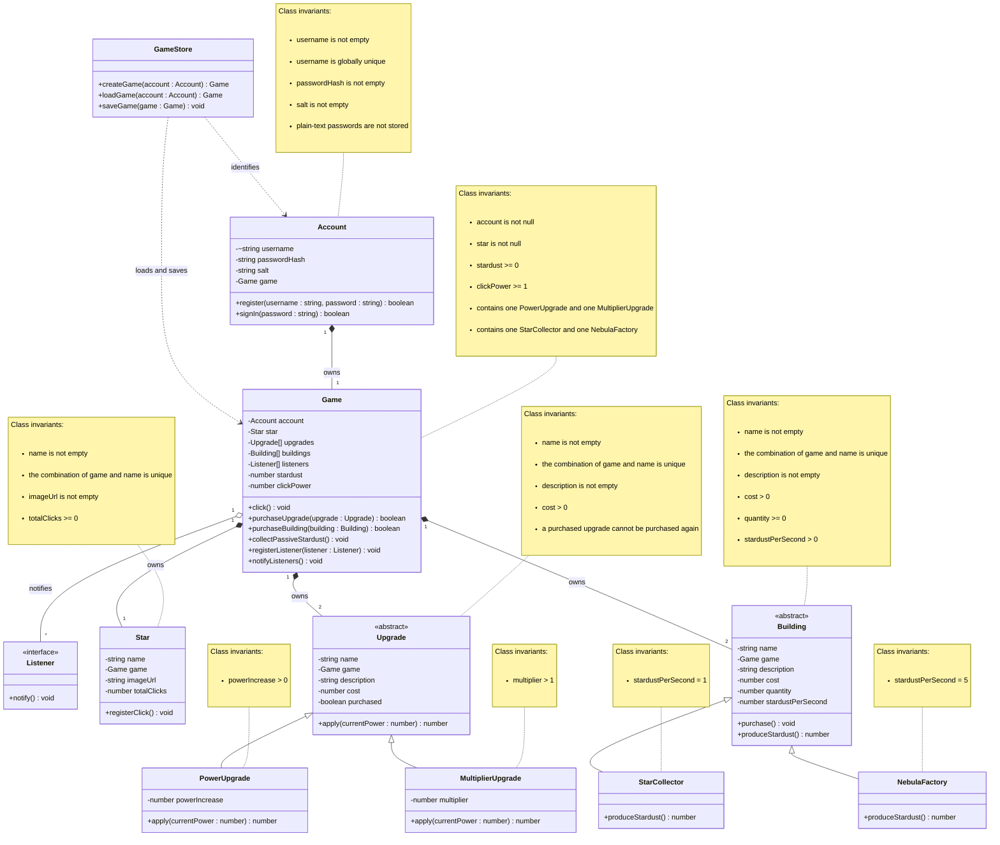

# Domain model

The domain model for **Cosmic Clicker** consists of an `Account` that owns one saved `Game`. Each game contains one clickable `Star`, two upgrades, and two buildings.

Players earn Stardust by clicking the star and from passive building production. Stardust can be used to purchase upgrades that increase click power and buildings that produce more Stardust over time.

# Design notes

- Added an `Account` class so each player can register, sign in, and own one saved game.
- Added secure password storage using a password hash and randomly generated salt instead of storing plain-text passwords.
- Added a `GameStore` class to create, load, and save game data.
- Added database persistence using PGlite.
- Added an abstract `Building` class with the `StarCollector` and `NebulaFactory` subclasses.
- Added passive Stardust production based on building quantity and production rate.
- Updated the `Game` class to manage upgrades, buildings, passive Stardust collection, and registered listeners.
- Added the listener pattern so registered listeners are notified when the game state changes.
- Added composition, aggregation, dependencies, multiplicities, and class invariants.
- Changed the upgrade and building relationships to show that each game owns exactly two upgrade objects and two building objects.
- Added persistence for Stardust, click power, total clicks, purchased upgrades, and building quantities.
- Updated the uniqueness constraints based on Phase 2 feedback.
- Removed global uniqueness from `Star.name`, `Upgrade.name`, and `Building.name`.
- Modelled star, upgrade, and building names as unique only within the game that owns them.
- Kept `Account.username` globally unique because it identifies an individual player.
- Updated the domain model to match the completed implementation.