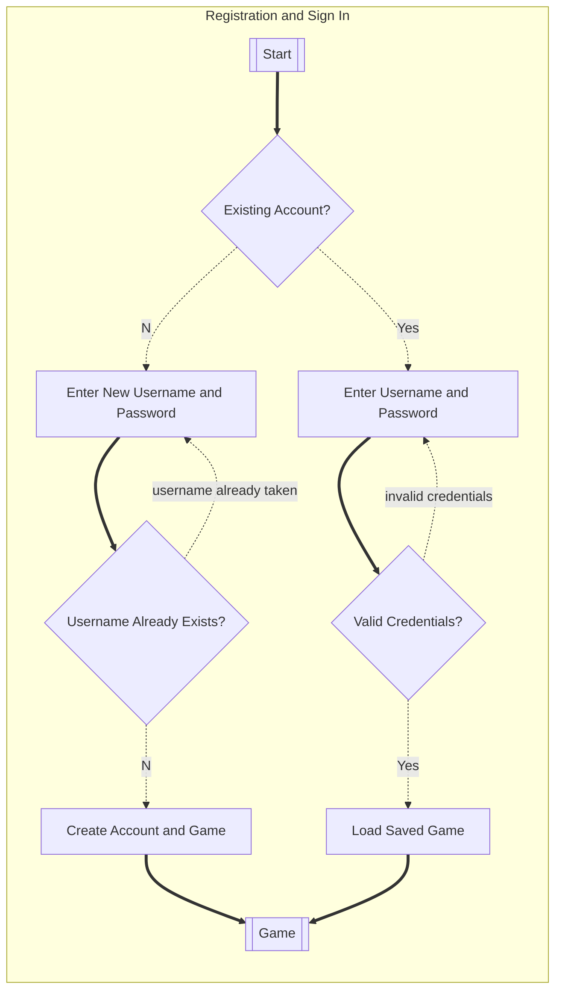
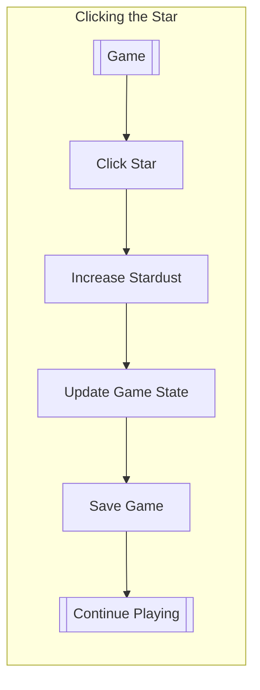
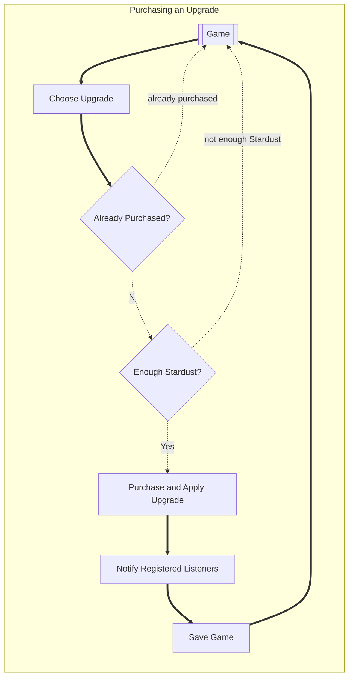
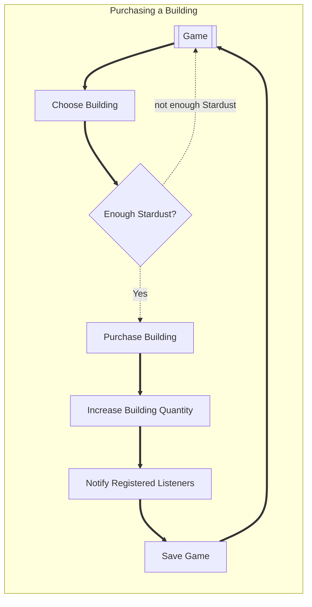
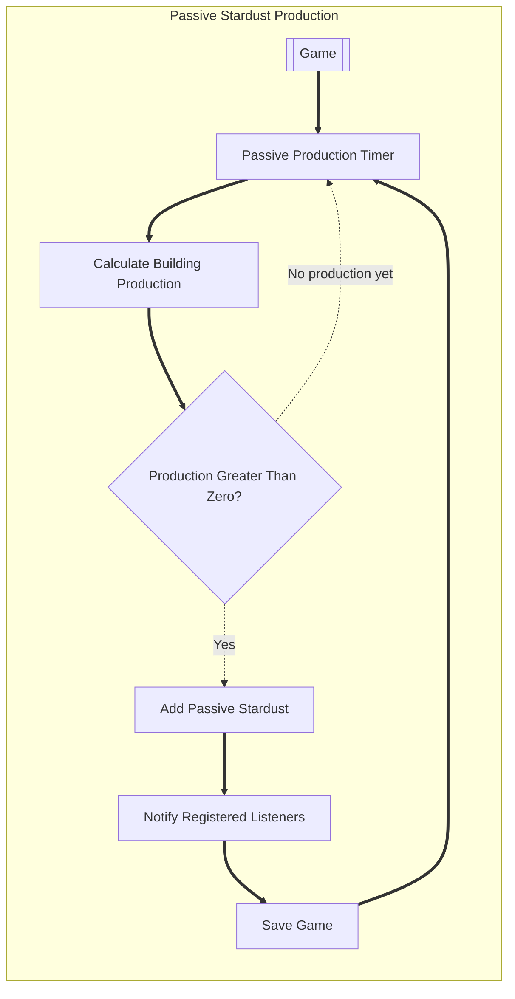

# Flows of interaction for phase 2

## Registration and Sign In

This flow shows how a new player creates an account and how an existing player signs in. Registration fails when the username already exists, while sign-in fails when the credentials are invalid.

 
## Clicking the Star
 
This flow shows how the player clicks the star to earn Stardust. The amount earned is based on the current click power. The click count and game state are updated and saved.
 

 
## Purchasing an Upgrade
 
This flow shows how the player purchases an upgrade. The purchase succeeds only when the player has enough Stardust and the upgrade has not already been purchased.
 

 
## Purchasing a Building
 
This flow shows how the player purchases a building. Buildings may be purchased multiple times, so a successful purchase increases the building quantity.
 

 
## Passive Stardust Production
 
This flow shows how purchased buildings automatically generate Stardust. If the player does not own any buildings, no passive Stardust is added.
 

## Changes since phase 1

- New players can register by entering a username and password.
- Registration fails when the username already exists.
- Existing players can sign in using their saved credentials.
- Invalid credentials return the player to the sign-in step.
- A new account receives a new game.
- A returning player loads their previously saved game.
- Clicking the star increases Stardust according to the current click power.
- Clicking also increases the star's total click count.
- Upgrades can only be purchased once.
- Upgrade purchases fail when the upgrade is already owned or the player does not have enough Stardust.
- Buildings can be purchased more than once.
- Each successful building purchase increases the building quantity.
- Buildings automatically produce passive Stardust.
- No passive Stardust is added when the total building production is zero.
- The game notifies registered listeners when its state changes.
- Updated game state is saved after clicks, purchases, and passive Stardust collection.
- Sign-out was removed because it is not included in the final implementation.
- The purchasing flow was separated into upgrade and building flows because upgrades and buildings follow different purchase rules.
- The registration flow was added to address the instructor feedback about the missing create-account path and duplicate-username error path.
- Error edges are labeled with what actually failed (e.g. "username already taken", "invalid credentials", "not enough Stardust") rather than plain "Yes"/"No", so the diagram itself shows what each error means.
